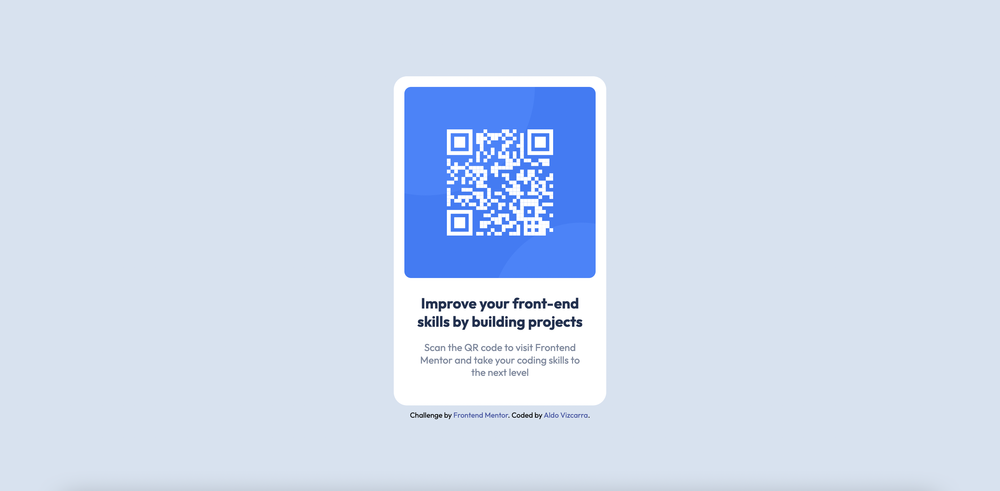

# Frontend Mentor - QR code component solution

This is a solution to the [QR code component challenge on Frontend Mentor](https://www.frontendmentor.io/challenges/qr-code-component-iux_sIO_H). Frontend Mentor challenges help you improve your coding skills by building realistic projects.

## Table of contents

- [Overview](#overview)
  - [Screenshot](#screenshot)
  - [Links](#links)
- [My process](#my-process)
  - [Built with](#built-with)
  - [What I learned](#what-i-learned)
  - [Continued development](#continued-development)
  - [Useful resources](#useful-resources)
- [Author](#author)

## Overview

QR code component solution

### Screenshot

### Links

- Solution URL: [Github](https://github.com/aldovizcarra/qr-code-component)
- Live Site URL: [Live Site](https://aldovizcarra.github.io/qr-code-component/)

## My process

I wrote the markup and then I setup the colors and typography. I then centered and aligned everything. Finally I added the paddings and margins.

### Built with

- Semantic HTML5 markup
- CSS custom properties
- Flexbox
- Mobile-first workflow

### What I learned

I learned how to make a QR code component.

### Continued development

Continue learning flexbox and grid.

### Useful resources

- [Kevin Powell Discord](https://discord.gg/wqTAvQJE) - This discord gave me some tips and feedback.

## Author

- Website - [Aldo Vizcarra](https://github.com/aldovizcarra)
- Frontend Mentor - [@aldovizcarra](https://www.frontendmentor.io/profile/aldovizcarra)
